# Awesome AI Code Chat Assistant 🚀

  

  
  
  
  
  
  

> **A curated list of top-tier SaaS platforms & open-source GitHub projects for Agentic Coding, Codebase-Aware Chat, Multi-File Editing & Autonomous Terminal Integration.** 🤖⚡

*Last updated: October 2026*

---

## 🔍 Overview & Market Insight

This repository tracks leading commercial **SaaS platforms** and **open-source GitHub repositories** for **AI Code Chat Assistants**. These AI tools empower software engineers to perform codebase-wide context retrieval, execute multi-file edits, automate repetitive refactorings, and delegate complex coding tasks to autonomous AI agents.

### 📊 Market Dynamics & Sector Concentration
> 💡 **Estimated Sector Market Size:** The global AI coding assistants & agentic developer tools market is projected at **$7.5 Billion - $10 Billion (2026)** with an annual growth rate exceeding **45% CAGR**.
> 
> ⚖️ **Market Structure:** The sector is **moderately fragmented**, featuring dominant commercial behemoths (GitHub Copilot, Cursor, Amazon Q) alongside a rapidly maturing, highly adopted open-source ecosystem (OpenHands, Cline, Aider, Continue). While network effects and IDE integrations create strong category leaders, open-source model neutrality and local/on-prem security prevent complete "winner-take-all" consolidation.

---

## 📋 Table of Contents 

- [🤖 SaaS / Hosted Platforms](#-saas--hosted-platforms)
- [🔓 Open-Source GitHub Projects](#-open-source-github-projects)
  - [⚡ Autonomous Coding Agents](#-autonomous-coding-agents)
  - [💻 IDE-Integrated Assistants](#-ide-integrated-assistants)
  - [🖥️ Terminal & CLI Agents](#-terminal--cli-agents)
  - [🛠️ Editor Forks & Extension Frameworks](#️-editor-forks--extension-frameworks)
- [⭐ Star History](#-star-history)
- [💖 Support & Sponsorship](#-support--sponsorship)
- [🤝 How to Contribute](#-how-to-contribute)
- [⚠️ Disclaimer](#️-disclaimer)

---

## 🤖 SaaS / Hosted Platforms

| Product | 🏢 Company Size / Valuation / Revenue | 💰 Free Tier & Pricing | 📝 Key Capabilities & Details |
| :--- | :--- | :--- | :--- |
| **[Amazon Q Developer](https://aws.amazon.com/q/developer/)** | **~$1.7 Trillion** (Parent: Amazon / AWS) | **Free tier available**; Pro tier at $19/user/month | Formerly CodeWhisperer. Tight AWS integration with chat, completion, and enterprise-grade agent capabilities. |
| **[GitHub Copilot Chat](https://github.com/features/copilot)** | **~$3.3 Trillion** (Parent: Microsoft) / ~$1B–$2B ARR | **Free tier**: 2,000 completions + 50 agent requests/mo; **Pro**: $10/mo | The most widely adopted AI coding assistant. Sits inside VS Code, JetBrains, Neovim, and Visual Studio with agent mode, MCP support, and sandboxed execution. |
| **[Cursor Chat](https://cursor.com/)** | **$60 Billion** (Acquired by SpaceX, 2026) / $4B+ ARR | **Free (Hobby)**; **Pro**: $20/mo, **Pro+**: $60/mo, **Ultra**: $200/mo | AI-first VS Code fork with polished multi-file agent (Composer) for cross-file refactoring and test modifications. |
| **[Replit Agent](https://replit.com/)** | **$9 Billion** (Valuation, 2026) / ~$1B Run-rate ARR | **Free tier available**; Core/Agent plans available | Cloud IDE with AI builder. Describe an app and Replit generates, runs, and deploys it from the browser. |
| **[Cody Chat](https://sourcegraph.com/cody)** | **$2.6 Billion** (Sourcegraph Valuation) / ~$50M ARR | **Free tier available**; Enterprise pricing available | Sourcegraph's AI assistant with codebase-wide context powered by Sourcegraph's code search index. |
| **[CodeRabbit](https://coderabbit.ai/)** | **$1.5 Billion** (Valuation, Series C 2026) | **14-day free trial**; Pro tier starts at $15/user/month | AI-powered code review assistant. Provides PR summaries, line-by-line suggestions, and interactive chat on code changes. |
| **[Codeium Chat](https://codeium.com/)** | **$1.25 Billion+** (Acquired by Cognition AI) / ~$80M ARR | **Free for individuals**; Pro/Enterprise paid tiers | Free AI completion and chat across 70+ editors. Windsurf (their VS Code fork) adds "Cascade" agent for long-running tasks. |
| **[Tabnine Chat](https://www.tabnine.com/)** | **Tens of Millions** (Acquired by Tricentis, 2026) / ~$15M ARR | **Free tier available**; Pro tier at $12/user/month | Privacy-focused AI coding assistant with on-premises deployment option and enterprise-grade data handling. |
| **[Phind](https://www.phind.com/)** | **N/A** (Startup, Private) | **Free tier available**; Pro tier at $20/month | AI search engine optimized for developers. Answers technical questions with code examples and citations. |

---

## 🔓 Open-Source GitHub Projects

The open-source AI code chat ecosystem is vibrant and production-proven, sorted below by **GitHub Star Count** (descending).

### ⚡ Autonomous Coding Agents

- **[OpenHands](https://github.com/All-Hands-AI/OpenHands)**   
  **Production-grade autonomous software agent platform (formerly OpenDevin).** **MIT licensed**, **64,000+ GitHub stars**.  
  *Key features:* Modular SDK, optional container sandboxing, deterministic event-sourced replay, multi-modal capabilities across CLI, VS Code, and web UI.

- **[Cline](https://github.com/cline/cline)**   
  **Autonomous coding agent for VS Code and terminal.** **Apache-2.0 licensed**, **62,000+ GitHub stars**.  
  *Key features:* Plan/Act modes, execution checkpoints for instant rollback, custom prompt rules, MCP tool extensions, human-in-the-loop permission approvals.

- **[Aider](https://github.com/Aider-AI/aider)**   
  **Git-native AI pair programming in your terminal.** **Apache-2.0 licensed**, **26,000+ GitHub stars**.  
  *Key features:* Automatic repository map, auto-commits with clean git messages, terminal linting/testing loops, voice-to-code capabilities.

- **[AutoGPT](https://github.com/Significant-Gravitas/AutoGPT)**   
  **Visionary open-source AI agent ecosystem.** **MIT licensed**, **170,000+ GitHub stars**.  
  *Key features:* Autonomous goal accomplishment, multi-agent orchestrations, code generation capabilities.

---

### 💻 IDE-Integrated Assistants

- **[Continue](https://github.com/continuedev/continue)**   
  **Open-source AI code assistant for VS Code and JetBrains.** **Apache-2.0 licensed**, **36,000+ GitHub stars**.  
  *Key features:* Connect any local or cloud LLM, custom inline edit and chat workflows, configurable prompts, local context indexers.

- **[Tabby](https://github.com/TabbyML/tabby)**   
  **Self-hosted AI coding assistant — on-premises alternative to GitHub Copilot.** **Apache-2.0 licensed**, **22,000+ GitHub stars**.  
  *Key features:* Consumer-grade GPU support, self-contained architecture (no external DB), repository RAG indexing, enterprise data privacy.

---

### 🖥️ Terminal & CLI Agents

- **[Mentat](https://github.com/AbanteAI/mentat)**   
  **CLI coding assistant that coordinates edits across multiple files.** **Apache-2.0 licensed**, **4,500+ GitHub stars**.  
  *Key features:* Command-line code editing, context awareness across directory trees, interactive terminal workflow.

- **[CoderAI](https://pypi.org/project/coderai-agent/)**   
  **Feature-rich AI coding agent CLI with MCP support.**  
  *Key features:* 45+ built-in tools (bash, file editor, git, grep, web search), subagent background execution, 80+ slash commands.

- **[Vaal](https://pypi.org/project/vaal-code/)**   
  **AI coding agent CLI with AirLLM local model execution.**  
  *Key features:* Layer-by-layer inference to run 70B parameter models on 4GB VRAM, self-repair mechanisms, remote web interface.

- **[ILX AI CLI](https://pypi.org/project/ilx-ai-cli/)**   
  **Terminal AI coding assistant with persistent project memory.**  
  *Key features:* Plan/review/act execution loop, semantic codebase index, automated test-fix iterations.

---

### 🛠️ Editor Forks & Extension Frameworks

- **[PearAI](https://github.com/trypear/pearai-submodule)**   
  **Open-source AI-first code editor.** **Apache-2.0 licensed**, **4,000+ GitHub stars**.  
  *Key features:* Open-source VS Code fork with native AI agent integrations.

- **[Void](https://github.com/voideditor/void)**   
  **Open-source Cursor alternative.** **Apache-2.0 licensed**, **15,000+ GitHub stars**.  
  *Key features:* Full control over hosting, model selection, and private codebase indexing inside VS Code fork.

---

## ⭐ Star History

---

## 💖 Support & Sponsorship

Thank you for exploring and using **Awesome AI Code Chat Assistant**! 🌟 

If this curated list helps you find the right AI coding tools, please consider supporting the project:
- ⭐ **Star** this repository to help others discover it!
- 🔀 **Fork** and contribute new tools or updates via Pull Requests.
- 📢 **Share** with your friends, team, and developer communities.
- ☕ **Buy me a coffee** to support ongoing updates and maintenance:

---

## 🤝 How to Contribute

1. Fork the repository.
2. Edit `README.md` to add or update entry details.
3. Ensure entries include product name, link, concise 1-2 sentence description, and accurate licensing/pricing.
4. Submit a Pull Request describing your changes.

---

## ⚠️ Disclaimer

- This is a **community-curated** list — non-exhaustive and independent.
- Always review security policies and data retention agreements before providing proprietary codebases to external AI models.
- Also check out the master awesome list collection at [Awesome-Awesome-Awesome](https://github.com/ishandutta2007/Awesome-Awesome-Awesome).

---

  <b>Built for developers, engineering leads, and AI tool builders worldwide. 🚀</b>

